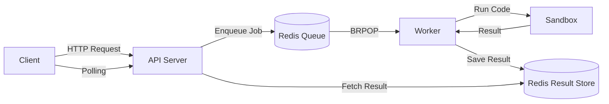
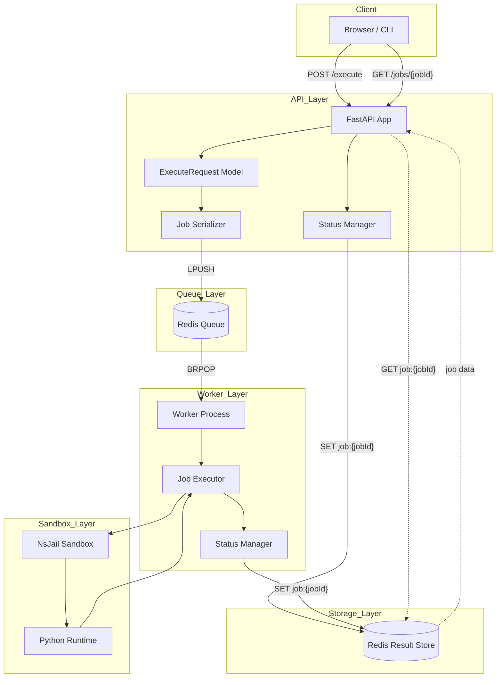
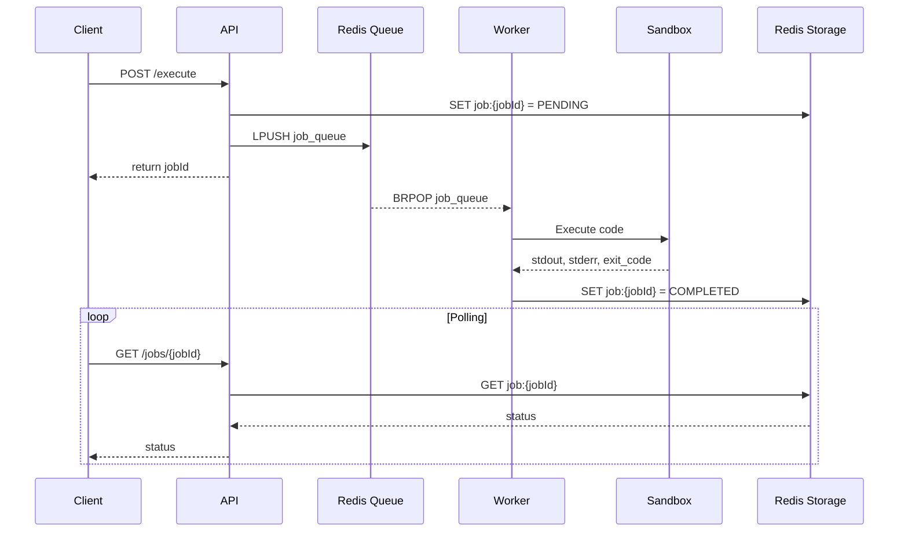

## Overview

```mermaid
flowchart LR
    Client -->|HTTP Request| API[API Server]
    API -->|Enqueue Job| Redis[(Redis Queue)]
    Redis -->|BRPOP| Worker
    Worker -->|Run Code| Sandbox
    Sandbox -->|Result| Worker
    Worker -->|Save Result| RedisResult[(Redis Result Store)]
    Client -->|Polling| API
    API -->|Fetch Result| RedisResult

```

## Component

```mermaid
flowchart TB

    subgraph Client
        A1[Browser / CLI]
    end

    subgraph API_Layer
        B1[FastAPI App]
        B2[ExecuteRequest Model]
        B3[Job Serializer]
        B4[Status Manager]
    end

    subgraph Queue_Layer
        C1[(Redis Queue)]
    end

    subgraph Worker_Layer
        D1[Worker Process]
        D2[Job Executor]
        D3[Status Manager]
    end

    subgraph Sandbox_Layer
        E1[NsJail Sandbox]
        E2[Python Runtime]
    end


    subgraph Storage_Layer
        F1[(Redis Result Store)]
    end


    A1 -->|POST /execute| B1
    B1 --> B2
    B1 --> B4
    B4 -->|"SET job:{jobId}"| F1
    B2 --> B3
    B3 -->|LPUSH| C1

    C1 -->|BRPOP| D1
    D1 --> D2
    D2 --> E1
    E1 --> E2
    E2 --> D2

    D2 --> D3
    D3 -->|"SET job:{jobId}"| F1

    A1 -->|"GET /jobs/{jobId}"| B1
    B1 -.->|"GET job:{jobId}"| F1
    F1 -.->|"job data"| B1
```

## Execution Flow (Sequence Diagram)

```mermaid
sequenceDiagram
    participant Client
    participant API
    participant Redis Queue
    participant Worker
    participant Sandbox
    participant Redis Storage

    Client->>API: POST /execute
    API->>Redis Storage: SET job:{jobId} = PENDING
    API->>Redis Queue: LPUSH job_queue
    API-->>Client: return jobId

    Redis Queue-->>Worker: BRPOP job_queue
    Worker->>Sandbox: Execute code
    Sandbox-->>Worker: stdout, stderr, exit_code
    Worker->>Redis Storage: SET job:{jobId} = COMPLETED
    
    loop Polling
        Client->>API: GET /jobs/{jobId}
        API->>Redis Storage: GET job:{jobId}
        Redis Storage-->>API: status
        API-->>Client: status
    end
```
