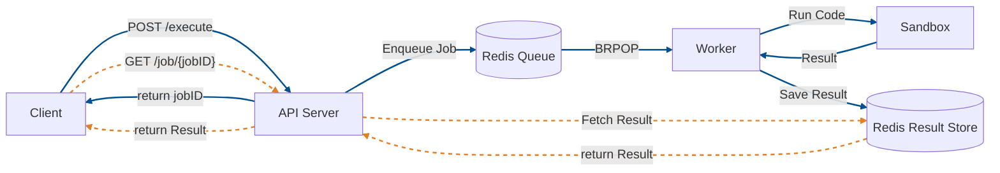
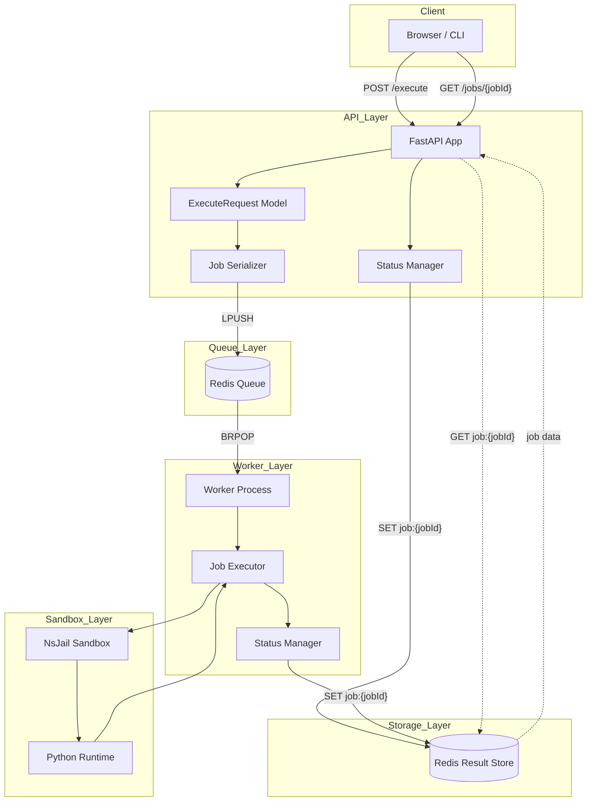
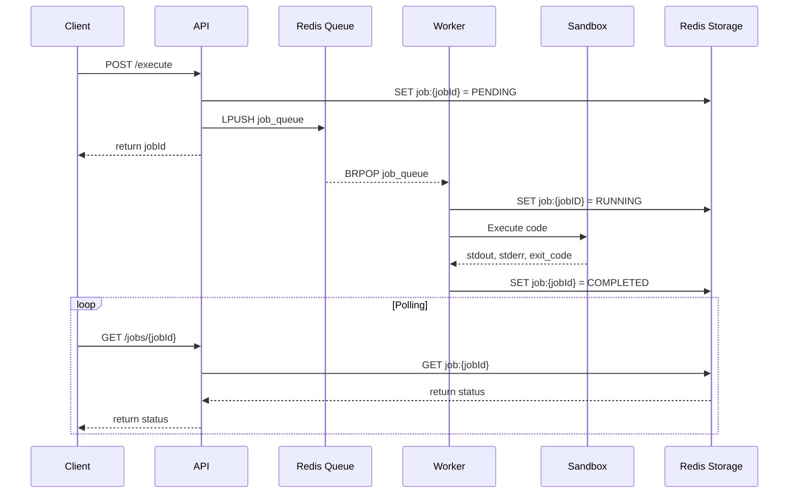
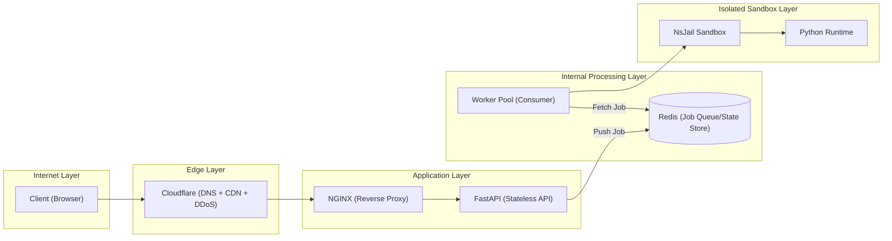

## Overview

```mermaid
flowchart LR
    %% Request Flow (먼저 선언 → 위쪽 배치)
    Client -->|POST /execute| API[API Server]
    API -->|return jobID| Client
    API -->|Enqueue Job| Redis[(Redis Queue)]
    Redis -->|BRPOP| Worker
    Worker -->|Run Code| Sandbox
    Sandbox -->|Result| Worker
    Worker -->|Save Result| RedisResult[(Redis Result Store)]

    %% Polling Flow (나중 선언 → 아래쪽 배치)
    Client -..->|"GET /job/{jobID}"| API
    API -..->|Fetch Result| RedisResult
    RedisResult -..->|return Result| API
    API -..->|return Result| Client

    %% 0~6: Request Flow (파란 실선)
    linkStyle 0,1,2,3,4,5,6 stroke:#004F90,stroke-width:2px
    %% 7~10: Polling Flow (주황 점선)
    linkStyle 7,8,9,10 stroke:#E67E22,stroke-width:2px,stroke-dasharray:5 5
```

## Component

```mermaid
flowchart TB

    subgraph Client
        A1[Browser / CLI]
    end

    subgraph API_Layer
        B1[FastAPI App]
        B2[ExecuteRequest Model]
        B3[Job Serializer]
        B4[Status Manager]
    end

    subgraph Queue_Layer
        C1[(Redis Queue)]
    end

    subgraph Worker_Layer
        D1[Worker Process]
        D2[Job Executor]
        D3[Status Manager]
    end

    subgraph Sandbox_Layer
        E1[NsJail Sandbox]
        E2[Python Runtime]
    end


    subgraph Storage_Layer
        F1[(Redis Result Store)]
    end


    A1 -->|POST /execute| B1
    B1 --> B2
    B1 --> B4
    B4 -->|"SET job:{jobId}"| F1
    B2 --> B3
    B3 -->|LPUSH| C1

    C1 -->|BRPOP| D1
    D1 --> D2
    D2 --> E1
    E1 --> E2
    E2 --> D2

    D2 --> D3
    D3 -->|"SET job:{jobId}"| F1

    A1 -->|"GET /jobs/{jobId}"| B1
    B1 -.->|"GET job:{jobId}"| F1
    F1 -.->|"job data"| B1
```

## Execution Flow (Sequence Diagram)

```mermaid
sequenceDiagram
    participant Client
    participant API
    participant Redis Queue
    participant Worker
    participant Sandbox
    participant Redis Storage

    Client->>API: POST /execute
    API->>Redis Storage: SET job:{jobId} = PENDING
    API->>Redis Queue: LPUSH job_queue
    API-->>Client: return jobId

    Redis Queue-->>Worker: BRPOP job_queue
    Worker->>Redis Storage: SET job:{jobID} = RUNNING
    Worker->>Sandbox: Execute code
    Sandbox-->>Worker: stdout, stderr, exit_code
    Worker->>Redis Storage: SET job:{jobId} = COMPLETED
    
    loop Polling
        Client->>API: GET /jobs/{jobId}
        API->>Redis Storage: GET job:{jobId}
        Redis Storage-->>API: return status
        API-->>Client: return status
    end
```

## run.ljweel.dev System Architecture

```mermaid
flowchart LR

    %% =========================
    %% Internet Layer
    %% =========================
    subgraph L1 [Internet Layer]
        Client["Client (Browser)"]
    end

    %% =========================
    %% Edge Layer
    %% =========================
    subgraph L2 [Edge Layer]
        CF["Cloudflare (DNS + CDN + DDoS)"]
    end

    %% =========================
    %% Application Layer
    %% =========================
    subgraph L3 [Application Layer]
        Nginx["NGINX (Reverse Proxy)"]
        API["FastAPI (Stateless API)"]
    end

    %% =========================
    %% Internal Processing Layer
    %% =========================
    subgraph L4 [Internal Processing Layer]
        Redis[("Redis (Job Queue/State Store)")]
        Worker["Worker Pool (Consumer)"]
    end

    %% =========================
    %% Isolated Sandbox Layer
    %% =========================
    subgraph L5 [Isolated Sandbox Layer]
        NsJail["NsJail Sandbox"]
        Python["Python Runtime"]
    end


    %% Connections
    Client --> CF
    CF --> Nginx
    Nginx --> API
    
    API -- "Push Job" --> Redis
    Worker -- "Fetch Job" --> Redis
    
    Worker --> NsJail
    NsJail --> Python

```